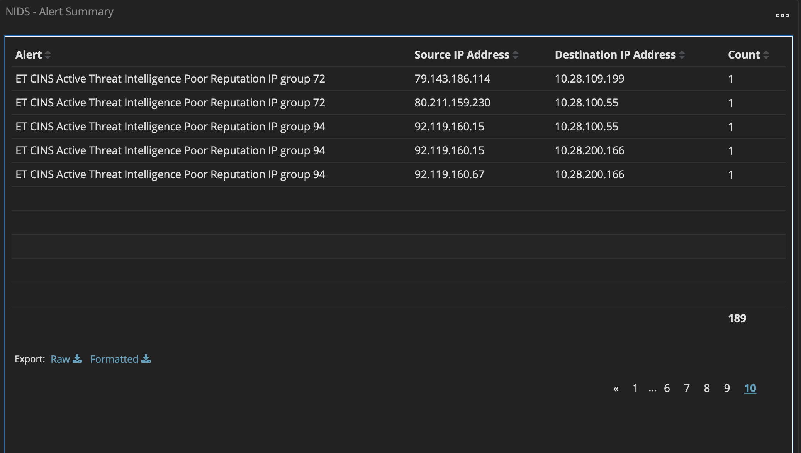
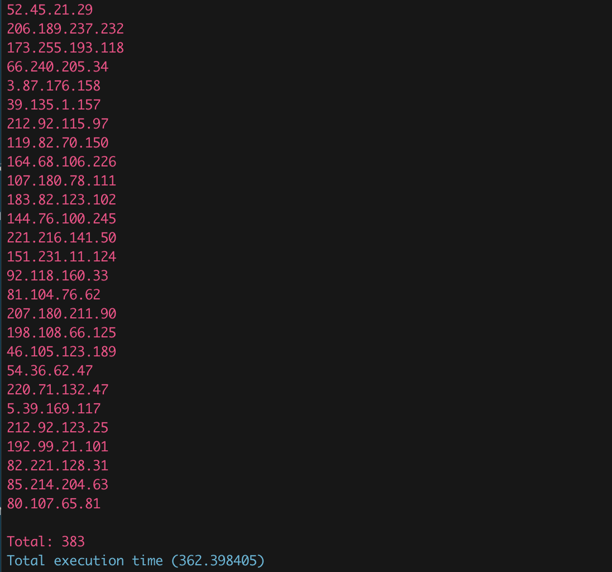

# Introduction
----

GoHound is a threat intelligence query tool for querying potentially malicious IP or domain names. It combines the MISP open source threat intelligence sharing platform as its back-end intelligence database, and currently integrates 69 open source threat intelligence data feeds from the open source community.

Anybody is welcome to submit threat intelligence feeds and build an open source threat intelligence database together.

# Usage
----

## Install

1.Install Dependencies
```
pip3 install OTXv2
pip3 install color
```
2.Modify the corresponding MISP Server and AlienVault API KEY in the program source code.


## Use
> ⚠️Note: The cached data needs to be used together with the MISP Server. If it is not built, the offline data in the warehouse can be used, but the feed data cannot be updated in time.

### Cache feed data

1.Cache all feed data

```
python3 GoHound.py --fetch all
```

2.Only cache single feed data

```
python3 GoHound.py --fetch <feedID>
```

3.Cache feed data with id n-m

```
python3 GoHound.py --fetch n m
```

### Offline query mode
1.Query the IP list
```
python3 GoHound.py --local --type ip <IP table>
```
2.Query the list of domain names
```
python3 GoHound.py --local --type domain <Domain name list>
```
3.Query a single IP
```
python3 GoHound.py --local --ip <IP>
```
4.Query a single domain name
```
python3 GoHound.py --local --domain <DOMAIN>
```

### Online query mode
1.Query the IP list
```
python3 GoHound.py --online --type ip <IP list>
```
2.Query the list of domain names
```
python3 GoHound.py --online --type domain <Domain name list>
```
3.Query a single IP
```
python3 GoHound.py --online --ip <IP>
```
4.Query a single domain name
```
python3 GoHound.py --online --domain <DOMAIN>
```

### Example

Suricata NIDS detections for low reputation IPs



The detection of low-trust IPs by scripts, the number of low-reputation IP detections increased from 95 to 383



# Refer to

----
- [MISP](https://www.misp-project.org/)
- [AlienVault OTX](https://otx.alienvault.com/api/)
- [Awesome-Threat-Intelligence](https://github.com/hslatman/awesome-threat-intelligence)
